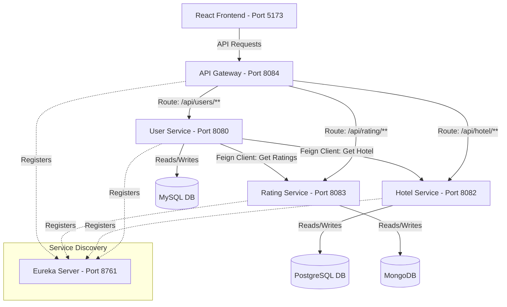

# 🏗️ Enterprise Hotel Rating Microservices System

A production-ready microservices-based hotel rating and management platform built with Spring Boot, Spring Cloud, and React. This project demonstrates distributed services communication, routing, Service Discovery, Feign Clients, dynamic persistence cross-mapping, and a glassmorphic dashboard UI.

---

## 🗺️ System Architecture

The project consists of 6 components working together. Communication between services is handled dynamically using Spring Cloud Eureka and OpenFeign client clients.



---

## 🧩 Microservices Overview

### 1. Eureka Server (`ServiceRegistry`)
*   **Role**: Service Discovery registry portal.
*   **Port**: `8761`
*   **URL**: `http://localhost:8761`

### 2. API Gateway (`ApiGateway`)
*   **Role**: Unified entry point for all API requests. Handles routing, path prefix translation, and CORS.
*   **Port**: `8084`
*   **CORS Configured**: Enabled globally for local development.

### 3. User Service (`UserService `)
*   **Role**: Manages User profiles and aggregates reviews.
*   **Port**: `8080` (Default)
*   **Database**: MySQL (`jdbc:mysql://localhost:3306/microservices`)
*   **Integrations**: OpenFeign clients to Rating and Hotel services to return resolved rating cards.

### 4. Hotel Service (`HotelService`)
*   **Role**: Manages Hotel catalogs and descriptions.
*   **Port**: `8082`
*   **Database**: PostgreSQL (`jdbc:postgresql://localhost:5432/microservice`)

### 5. Rating Service (`RatingService`)
*   **Role**: Stores feedback review logs.
*   **Port**: `8083`
*   **Database**: MongoDB (`mongodb://localhost:27017/microservice`)

### 6. React Frontend (`frontend`)
*   **Role**: Dashboard SPA built using **Vite + React + Vanilla CSS** with a dark glassmorphic design system.
*   **Port**: `5173`
*   **URL**: `http://localhost:5173`

---

## 🛠️ Technology Stack
*   **Backend**: Java 17, Spring Boot, Spring Cloud (Gateway, Netflix Eureka Server, OpenFeign, LoadBalancer).
*   **Frontend**: React (Vite), Lucide Icons, Custom CSS Variables, Glassmorphism, Native Fetch.
*   **Databases**:
    *   **MySQL**: Users database.
    *   **PostgreSQL**: Hotels catalog.
    *   **MongoDB**: Reviews and rating records.

---

## ⚡ Setup & Running Guide

### Step 1: Start Databases
Ensure MySQL, PostgreSQL, and MongoDB are running locally. Create the respective databases:
*   MySQL: `microservices`
*   PostgreSQL: `microservice`
*   MongoDB: `microservice` collection

### Step 2: Start Services (Strict Order)
To ensure discovery registry hooks register correctly, start components in this order:

1.  **ServiceRegistry (Eureka)**:
    ```bash
    cd ServiceRegistry && ./mvnw spring-boot:run
    ```
2.  **HotelService**:
    ```bash
    cd HotelService && ./mvnw spring-boot:run
    ```
3.  **RatingService**:
    ```bash
    cd RatingService && ./mvnw spring-boot:run
    ```
4.  **UserService**:
    ```bash
    cd "UserService " && ./mvnw spring-boot:run
    ```
5.  **ApiGateway**:
    ```bash
    cd ApiGateway && ./mvnw spring-boot:run
    ```

Check the Eureka Dashboard at `http://localhost:8761` to confirm all 4 microservices are successfully registered and online.

### Step 3: Run React Frontend
Navigate to the `frontend` directory, install packages, and spin up the Vite development server:
```bash
cd frontend
npm install
npm run dev
```
Open `http://localhost:5173` in your browser.

---

## 📡 API Reference Manual

All requests pass through the API Gateway at `http://localhost:8084`.

### Users Endpoints (`/api/users/**`)
| Method | Endpoint | Request Body | Description |
| :--- | :--- | :--- | :--- |
| **POST** | `/api/users/create` | `{ "name": "string", "email": "string", "about": "string" }` | Register a new user |
| **GET** | `/api/users/getAllUser` | *None* | Get list of all users |
| **GET** | `/api/users/getUserById/{userId}` | *None* | Get user by ID (includes resolved rating arrays and hotel details) |
| **PUT** | `/api/users/updateUser/{userId}` | `{ "name": "string", "email": "string", "about": "string" }` | Update user profile |
| **DELETE** | `/api/users/delete/{userId}` | *None* | Delete user |

### Hotels Endpoints (`/api/hotel/**`)
| Method | Endpoint | Request Body | Description |
| :--- | :--- | :--- | :--- |
| **POST** | `/api/hotel/create` | `{ "name": "string", "location": "string", "about": "string" }` | Add a new hotel |
| **GET** | `/api/hotel/getAllHotel` | *None* | Get list of all hotels |
| **GET** | `/api/hotel/getById/{id}` | *None* | Get hotel details by ID |
| **PUT** | `/api/hotel/update/{hotelId}` | `{ "name": "string", "location": "string", "about": "string" }` | Update hotel profile |
| **DELETE** | `/api/hotel/deletById/{id}` | *None* | Delete hotel |

### Ratings Endpoints (`/api/rating/**`)
| Method | Endpoint | Request Body | Description |
| :--- | :--- | :--- | :--- |
| **POST** | `/api/rating/create` | `{ "userId": "string", "hotelId": "string", "rating": 5, "feedback": "string" }` | Create a hotel rating review |
| **GET** | `/api/rating/getAllRating` | *None* | Retrieve all rating entries |
| **GET** | `/api/rating/getRatingByUserId/{userId}` | *None* | Get all ratings given by a user |
| **GET** | `/api/rating/getRatingByHotelId/{hotelId}` | *None* | Get all ratings given to a hotel |
